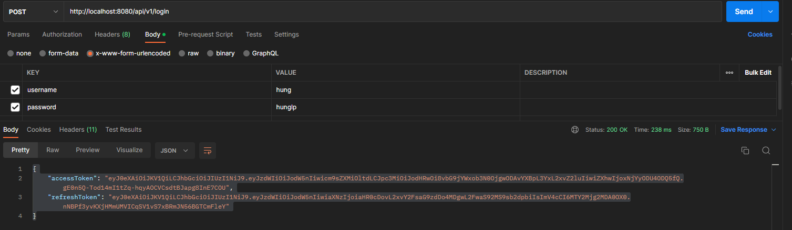
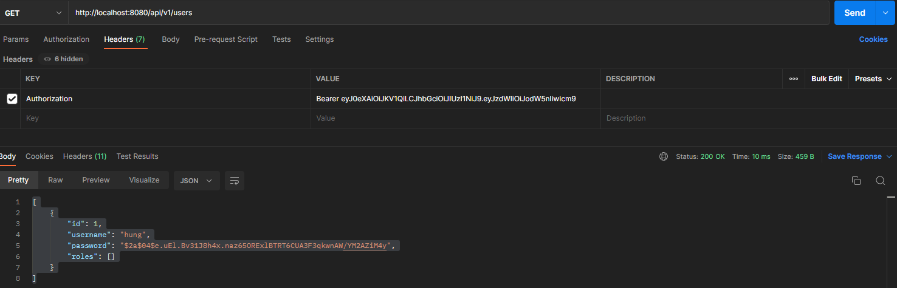

1. **Require** : Tạo DB  "spring-jwt"

* API Authen: 
  
   
   
   
   
* API Get users with access Token:

* API Refresh token:

2 **Dùng refresh token thay cho acccess token có được ko ?**
- Không được, vì hiệu lực của access token thường ít hơn sơ với refresh token.
Việc tạo ra refresh token để kéo dài thời gian hiệu lực của access token

3. ** Vì sao khi access token hết hạn thì cho hiện trang login luôn mà cần gọi API refresh token để làm gì  **
- Đa số access token thì hiệu lực là 2 tiếng. Trừ khi là các hệ thống ngân hàng thì mới cho người dùng login lại
Còn ví dụ Facebook thì sẽ ko thể bắt ng dùng login lại được. PHải làm thế nào cho ứng dụng chạy mượt

